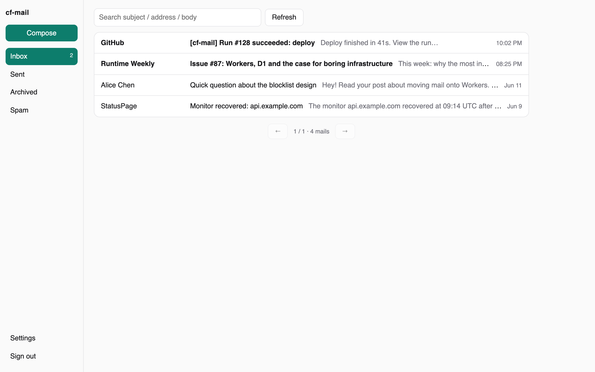
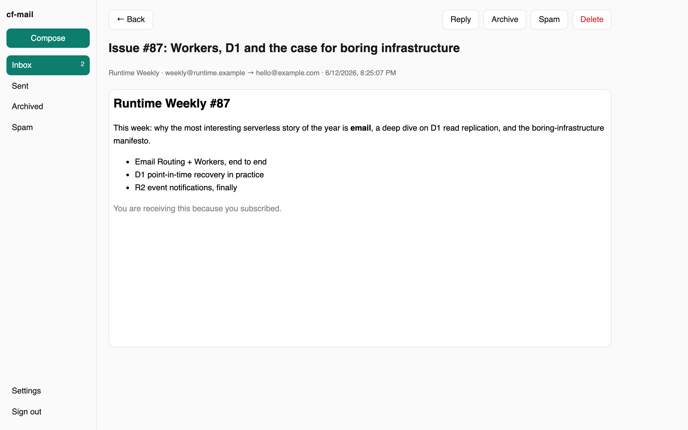
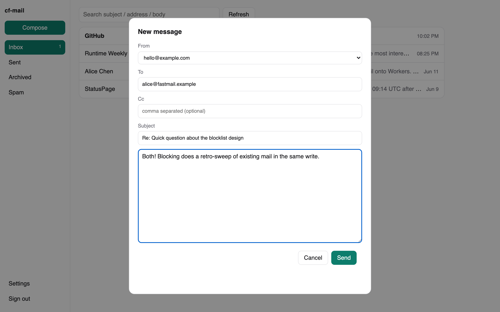
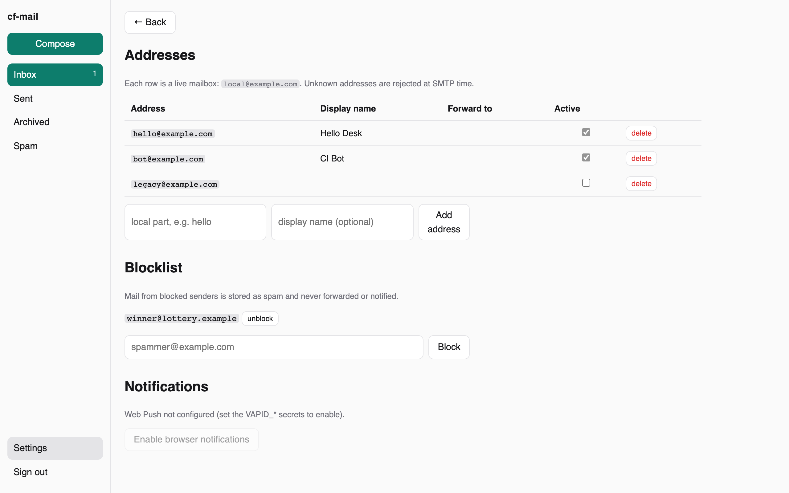

# cf-mail

[English](README.md) | **简体中文**

给自己域名用的自托管邮箱，**完整跑在 Cloudflare 上**——收信、发信、存储、网页客户端、手机推送。不需要 VPS、不碰 Postfix、不用伺候 IP 信誉。一个 Worker、一个 D1 数据库、一个 R2 桶。

> 本项目在 **[xtxt.top](https://xtxt.top)** 生产环境运行，承担该域名的全部邮件收发。完整实战记录：[把邮箱整个搬进 Cloudflare](https://xtxt.top/articles/self-hosted-email-on-cloudflare-workers)。



<table><tr>
<td width="33%"><a href="docs/screenshots/detail.png"></a></td>
<td width="33%"><a href="docs/screenshots/compose.png"></a></td>
<td width="33%"><a href="docs/screenshots/settings.png"></a></td>
</tr></table>

```
收信   MX → Cloudflare Email Routing（免费）
         └─ catch-all → 本 Worker
              ├─ 未知/停用地址 → SMTP 550 拒收
              ├─ postal-mime 解析 → 附件进 R2，正文/元数据进 D1
              ├─ 黑名单发件人 → 存为垃圾，不转发不通知
              └─ 可选：抄送一份到外部邮箱

发信   网页 / API → Worker 的 send_email 绑定（Email Service，自动签 DKIM）

读信   同一个 Worker 直接服务的网页客户端
         收件箱 / 已发送 / 已归档 / 垃圾 · 搜索 · 会话 ·
         联系人自动聚合 · 黑名单 · 附件

推送   新邮件 → Web Push（浏览器/PWA）与/或 APNs（你自己的 iOS App）
       —— 都是可选项，配了 secret 才启用
```

这套架构的核心价值：**邮件变成你自己数据库里的普通数据。** 会话分组是一条查询，搜索是一条 `LIKE`，黑名单是张表，"团队成员邮箱"是一行记录加一个转发字段。所有在托管邮箱里要"等官方出功能"的事，变成一次小小的 commit。

## 特性

- **邮箱管理就是 CRUD**——加一行记录即开通地址，置为停用即在 SMTP 层 `550` 拒收。群发垃圾死在门口，管地址永远不用碰 Cloudflare 控制台。
- **免费送 plus-addressing**——`you+newsletter@` 自动投递到 `you@`，原始地址保留在记录上，谁泄露了你的邮箱一查便知。
- **内置网页客户端**——文件夹、搜索、会话视图、附件、写信/回复（带规范的 `In-Reply-To`/`References` 线索头）、联系人自动聚合、一键拉黑。深色模式、移动端适配、前端零依赖。
- **双通道推送**——浏览器/PWA 走 Web Push（VAPID）；自己的 iOS 客户端走 APNs，且是 **Worker 直连**——Workers 的出站 `fetch` 能协商 APNs 要求的 HTTP/2，生产环境实证可行，不需要任何中转。
- **诚实的失败语义**——收信过程中 Worker 抛异常时，发件方邮件服务器按 SMTP 规范自动重试。邮件只会延迟，不会丢。
- **脚本友好的 API**——CI 或 AI Agent 一条 `curl` 就能发通知邮件。
- **Agent 邮件协议**——见 [Agent Mail Protocol（AMP）规范](docs/AGENT_MAIL_PROTOCOL.zh-CN.md)：把「给 agent 的邮箱」沉淀成协议（两类邮箱、双向有界通信、信任边界、来信即触发的投递队列）。

## Agent mail —— 给 AI agent 设计一个邮箱

一旦你开始跑 agent，邮件就不再是人对人的媒介，而变成另一种东西：**agent 与外部世界之间一个异步、持久、人人都能投递的缓冲池**。它是这世上唯一一个所有人、所有服务都已经在说的协议——所以一个有地址的 agent，不需要任何对接就能被任何人找到。cf-mail 的设计目标，是让一个 agent 能**安全地**拥有一个邮箱。它建立在三条公理上（完整模型见 **[Agent Mail Protocol](docs/AGENT_MAIL_PROTOCOL.zh-CN.md)**）：

- **邮箱是数据缓冲区，不是命令通道。** 邮件内容是数据，永不是 prompt。**接收**（写入缓冲区）、**读取**（agent 取出来、带着信任元数据）、**行动**（agent 自己的、可被管控的判断）是三个独立步骤——缓冲区绝不自动执行：收到一封信 ≠ 喂给模型，喂给模型 ≠ 照它做。
- **收发双方明确且有界。** 一个专用 agent 只与一组已知、白名单内的对象往来——而且是**双向**、默认拒收。这个边界不是限制，而是让 agent 可信到能无人值守运行的前提。
- **邮件本身永远不是命令。** 消息的任何属性——DKIM 通过、已知发件人、甚至"看起来像拥有者发的"——都不能把它的内容变成指令。信任信号决定**读得多警惕**，绝不决定**听不听**；任何有后果的动作都要一个不在邮件正文里的带外授权。

**为什么重要。** 邮件一次性把**致命三件套**（Simon Willison：接触私有数据、暴露于不可信内容、能对外通信）全塞给 agent——这正是天真的"agent 邮箱"危险的原因（参见 EchoLeak / CVE-2025-32711：一封零点击邮件把微软 Copilot 引导去外泄内部文件）。cf-mail 从两条腿上砍断三件套：可信 `meta` / 不可信内容的分离，把内容关进笼子、让它当不了指令；出站白名单封住爆炸半径，即便 agent 被劫持，"把密钥发给 attacker@evil.com" 也会因为对方不在白名单而失败。背景阅读：**[致命的三要素](https://xtxt.top/articles/lethal-trifecta)**。

**今天已交付：** 上面的 agent webhook（签名投递 + trust 块）。**完整协议**——`kind:agent` 邮箱、双向有界通信 + 动态回信凭证、`received → delivered → handled` ack 队列、按地址绑定的令牌、自描述 manifest、软/硬用户 rules、带 reason code 的事件日志可观测性——写在 **[AGENT_MAIL_PROTOCOL.zh-CN.md](docs/AGENT_MAIL_PROTOCOL.zh-CN.md)**，并已作为第二个实现跑在 [xtxt.top](https://xtxt.top) 上。

## 快速开始

```bash
git clone https://github.com/Coldplay-now/cf-mail.git && cd cf-mail
npm install
npx wrangler d1 create cf-mail            # 把 database_id 填进 wrangler.jsonc
npx wrangler r2 bucket create cf-mail
npx wrangler d1 execute cf-mail --remote --file=schema.sql
npx wrangler secret put AUTH_TOKEN        # 任意长随机串——这就是网页登录口令
npm run deploy
```

然后到控制台：启用 **Email Routing**（catch-all → *Send to Worker: cf-mail*）、启用 **Email Service**，以及那个所有人都会踩的坑——**再部署一次**，`send_email` 绑定才会真正挂上。打开 Worker 地址，用 token 登录，到 Settings 里建第一个地址。

👉 **完整的分步部署指南——DNS 记录、控制台每一屏、推送配置、验证测试、故障排查——见 [docs/DEPLOY.zh-CN.md](docs/DEPLOY.zh-CN.md)。**

## API

`/api/*` 下所有端点都要带 `Authorization: Bearer <AUTH_TOKEN>`：

| 端点 | 说明 |
|---|---|
| `GET /api/mails?folder=inbox\|sent\|archived\|spam&page=&q=` | 分页列表 + 计数 |
| `GET /api/mails/:id` | 全文 + 会话，自动标已读 |
| `PATCH /api/mails/:id` | `{read?, archived?, spam?}` |
| `DELETE /api/mails/:id` | 删除（连同 R2 附件） |
| `POST /api/send` | JSON `{from, to, cc?, subject, text, inReplyToId?}`, or multipart with `attachments` file parts (≤5 MiB) |
| `GET /api/attachments?key=` | 附件流式下载 |
| `GET/POST /api/addresses`、`PATCH/DELETE /api/addresses/:id` | 邮箱地址 CRUD |
| `GET/POST /api/contacts`、`DELETE /api/contacts/:address` | 联系人 + 黑名单 |
| `GET /api/push/key`、`POST/DELETE /api/push` | 推送订阅 |

```bash
curl -X POST https://mail.yourdomain.com/api/send \
  -H "Authorization: Bearer $TOKEN" -H "Content-Type: application/json" \
  -d '{"from":"bot","to":"you@gmail.com","subject":"构建失败","text":"..."}'
```

## 安全说明

- 网页客户端由单个 Bearer token 守门；建议给 Worker 挂自定义域名，token 当密码对待，轮换用 `wrangler secret put AUTH_TOKEN`。
- HTML 正文在**沙箱 iframe** 里渲染（禁脚本、非同源）——原样入库、展示时关笼子。远程图片会加载（追踪像素有效），介意的话自行在上游剥离。
- 给域名配 DMARC 策略，并且只通过签 DKIM 的 Email Service 通道发信；`p=reject` 之下混用未签名通道的邮件会被直接丢弃。

## 成本与边界

- **收信：免费**（Email Routing 不限量）。个人邮件量级的 D1/R2 用量可以忽略。
- **发信：Workers Paid（$5/月）**——本文写作时含每月 3,000 封。Email Service 仍在公测：单封收件人 ≤50；**收发均支持附件**（发信单封 ≤5 MiB；收信经 R2 无限制）。
- **没有 IMAP/POP**——第三方邮件客户端接不进来，界面就是这个网页客户端（或你基于 API 自建的 UI）。对一些人是硬伤，对另一些人是特性。
- 设计上单用户。多租户权限体系不在范围内。

## 出处

从 **[xtxt.top](https://xtxt.top)** 的邮件子系统中抽取而来——2026 年 6 月起与一个 Next.js 博客并肩跑在生产环境，同一条管道、同一套 schema，被真实邮件检验过。完整的迁移实战（包括部署指南排查表里的每一个坑的来历）：[把邮箱整个搬进 Cloudflare](https://xtxt.top/articles/self-hosted-email-on-cloudflare-workers)。

## 许可证

MIT
